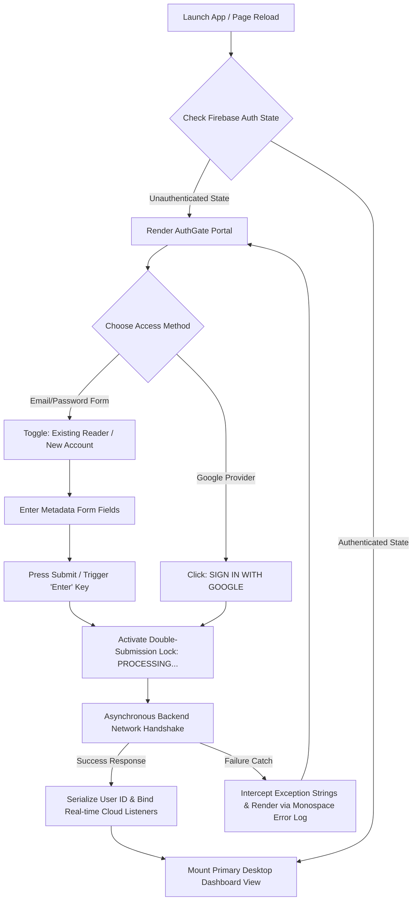
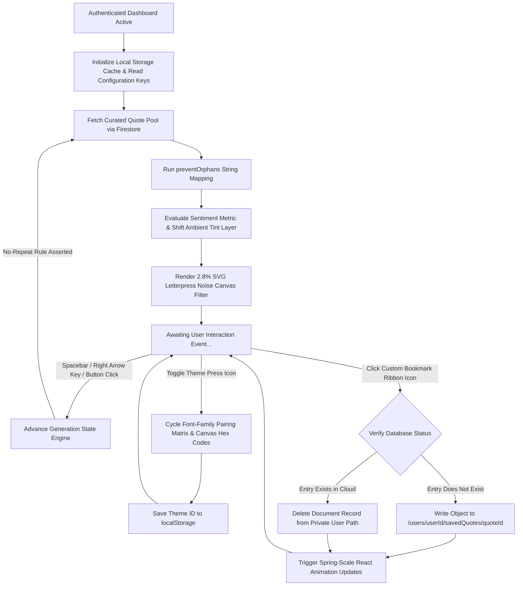

# CodeAlpha_Quotidian (The Quotidian Ledger)

Built as a high-performance single-page application using **React**, **TypeScript**, and **Tailwind CSS**, it is fully backed by a hardened **Google Cloud Firebase (Auth & Firestore)** infrastructure. Instead of treating user interfaces as flat digital templates, *The Quotidian* operates as a highly tactile, immersive reading journal that respects the rich history, constraints, and typographic layouts of real-world editorial print houses.
---

## 🎨 Core Presentation & Aesthetic Engineering

* **Tactile Letterpress Canvas Texture:** Implements a custom inline SVG-based fractal noise element mapped to a CSS background overlay at an eye-safe **2.8% opacity**. It utilizes intelligent blending modes dependent on the active layout style (`mix-blend-multiply` to carve paper fiber shadows into light stocks vs. `mix-blend-overlay` to catch surface light on dark ledgers) to mimic the "tooth" and fiber depth of heavy cardstock.
* **Dynamic Typography Kits Per Theme:** Features three completely unique configuration matrices that instantly shift the soul of the platform:
    * *The Quotidian (Default):* Classic cream paper layout (`#F4F1EA`) with elegant charcoal ink text, utilizing modern literary **Playfair Display** (serif) paired with **Space Grotesk** (display headings).
    * *The Obsidian Ledger:* High-contrast, tactical tech-manifesto vibe utilizing sharp **Cormorant Garamond / Fraunces** paired with **JetBrains Mono** on an ink-black matte canvas.
    * *The Archive Sepia:* Warm, weathered historical amber parchment stock paired with deep brown **EB Garamond** text and a nostalgic typewriter **Courier Prime** monospaced label layout.
* **Professional Typesetting Protection:** Includes a lightweight string processing helper (`preventOrphans`) that searches the text of an insight for its trailing space cluster and binds the final words using a non-breaking space character (`\u00A0`). This prevents single text words from dangling alone as orphans across fluid responsive viewports.
* **Ambient Sentiment-Based Lighting Tints:** Integrates a rule-based semantic text analyzer that updates an optional `sentiment` field (`philosophical`, `stoic`, `ambitious`, or `serene`). When an insight loads, the underlying paper canvas softly transitions its ambient undertone across a 1000ms duration to match the emotional frequency of the quote.

---

## ⚙️ Advanced Functional Architecture

* **Dual-Method Onboarding Registry:** Provides an industry-standard credential gate (`AuthGate.tsx`) styled like an authentic, flat vintage register form document. It supports split-tab configurations for **Email/Password registration/login** alongside a single-click third-party **Sign-In with Google** popup portal.
* **Private Cloud Curated Ledgers:** Links authenticated unique user sessions securely to a partitioned sub-collection pathway: `/users/{userId}/savedQuotes/{quoteId}`. Readers can toggle a decorative interactive bookmark ribbon to gracefully insert or commit deletions from their personal cloud archive in real time.
* **Index Catalog Drawer:** Features a slide-out panel utilizing the structural `border-8 border-white` framing rule. It processes a real-time searchable contributor registry and bracketed content classification tags (e.g., `[ TECHNOLOGY ]`, `[ PERSISTENCE ]`), allowing readers to filter the active quote rotation pool down to specialized historical disciplines.
* **Measured Auditory Narration:** Leveraged the native browser Web Speech API (`window.speechSynthesis`) configured at a deliberate, slow-paced utterance rate (`rate = 0.9`) paired with a dynamic text-to-speech engine selector. It includes a reactive telemetry node (`[ UTTERANCE ACTIVE ]` alongside an animated pulsing dot) that mounts and unmounts from the DOM instantly as speech tracks cycle.
* **Global Desktop Keyboard Macros:** Maps global keyboard listeners (`Spacebar` and `Right Arrow`) to trigger randomizer states seamlessly while executing `event.preventDefault()` to safeguard against window scroll jumping. Form input boundaries are checked securely to prevent interrupting readers while typing in search query or credential text blocks.
* **Persistent Configuration Memory:** Integrates persistent local hooks (`localStorage`) that serialize user settings across distinct browsing sessions. Reopening or refreshing the page immediately builds the interface with the reader's preferred typography kit, active index filter, and selected narration voice pre-loaded before the initial DOM paint.

---

## 🗺️ Application Workflows & System Architecture

### 1. Unified Authentication Gate Workflow
When a reader lands on the application, the system references the unified authentication and state initialization cycle:


### 2. Live Core Interaction Loop & Personalization Matrix
Once authenticated, the runtime event pipeline manages text typesetting rules, background textures, state persistence, and real-time database write updates:

### File Structure
The codebase follows a strictly modular structure, separating the presentation layer from the secure Firebase transactional infrastructure:
```bash
├── assets/                       # Static media and brand visual design tokens
├── src/
│   ├── components/
│   │   └── AuthGate.tsx          # Dual-ledger registration form gate with unmasking fields
│   ├── api.ts                    # Extraction APIs handling quote fetching and seeding fallbacks
│   ├── App.tsx                   # Central viewport matrix, global key listeners, and state core
│   ├── firebase.ts               # Secure SDK setup and human-readable error-trapping engines
│   ├── main.tsx                  # Web entry pipeline mount
│   ├── types.ts                  # Typed code schemas modeling Quote structures and themes
│   └── index.css                 # Base stylesheet housing web font loads and Tailwind injections
├── .env                          # Local active environment keys (Hidden via .gitignore)
├── .env.example                  # Open-source blank prototype layout for environment tracking
├── .gitignore                    # Local production security filter guarding environment variables
├── firebase-applet-config.json   # Internal engine ecosystem metadata configurations
├── firebase-blueprint.json       # Structural architecture mapping paths and database properties
├── firestore.rules               # Hardened, high-security Zero-Trust access gates
├── index.html                    # Root HTML application shell container
├── metadata.json                 # Repository tracking manifests
├── package.json                  # Managed build settings and dependency matrices
├── quotes-seed.json              # Curated JSON records used for empty-state base initializations
├── security_spec.md              # Invariant testing matrix verifying write mitigation policies
├── tsconfig.json                 # Core TypeScript compiler configuration rules
└── vite.config.ts                # Vite bundler processing modules and routing pipelines
```
